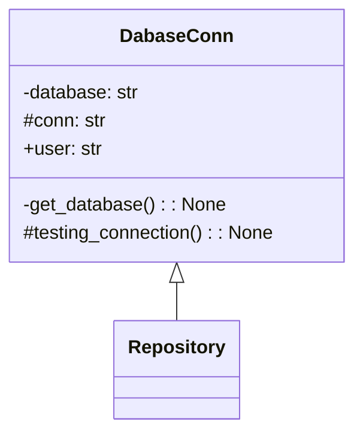

Teoricamente atributos protected não deveriam ser acessados pelo objeto, mas o python acaba
mas parece não existir o tipo protected, então é uma convensão colocar um underline para
 indicar que o atributo é do "tipo" protected

