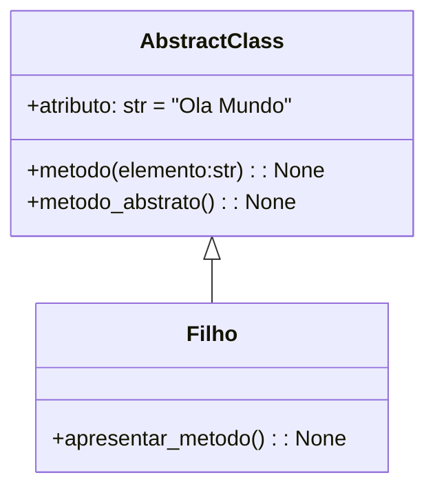

```mermaid
classDiagram
     AbstractClass <|-- Filho

     class AbstractClass {
       +atributo: str = "Ola Mundo"
       +metodo(elemento:str): None
       +metodo_abstrato(): None
     }

     class Filho {
        +apresentar_metodo(): None
     }

```

