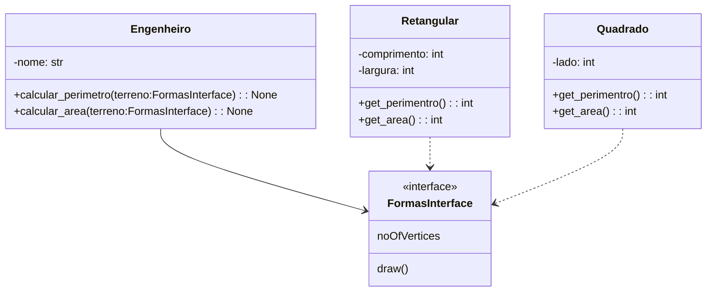

## O Engenheiro se associa a qualquer elemento que implemente a Interface, seja o quadrado ou o retangulo.

Principio Aberto e Fechado (O) - SOLID, com interfaces

```mermaid
classDiagram

    Engenheiro --> FormasInterface
    Retangular ..> FormasInterface
    Quadrado ..> FormasInterface

    class Engenheiro  {
        -nome: str
        +calcular_perimetro(terreno:FormasInterface): None
        +calcular_area(terreno:FormasInterface): None
    }

    class FormasInterface{
        <<interface>>
        noOfVertices
        draw()
    } 

    class Retangular {
        -comprimento: int
        -largura: int
        +get_perimentro(): int
        +get_area(): int
    }

    class Quadrado {
        -lado: int
        +get_perimentro(): int
        +get_area(): int
    }


```

