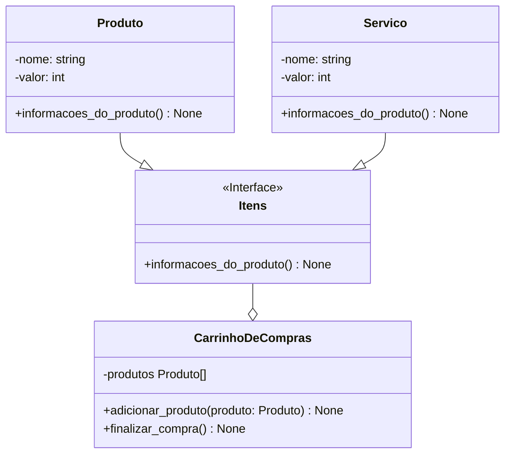

# Agregação das Classes

### Diagrama UML

```mermaid
classDiagram

    Itens --o CarrinhoDeCompras  
    Produto --|> Itens
    Servico --|> Itens


    class CarrinhoDeCompras {
        -produtos Produto[]
        +adicionar_produto(produto: Produto) None
        +finalizar_compra() None
        
    }

    class Produto {
        -nome: string
        -valor: int
        +informacoes_do_produto() None
    }

    class Servico {
        -nome: string
        -valor: int
        +informacoes_do_produto() None
    }

    class Itens {
        <<Interface>>
        +informacoes_do_produto() None
    }

```
