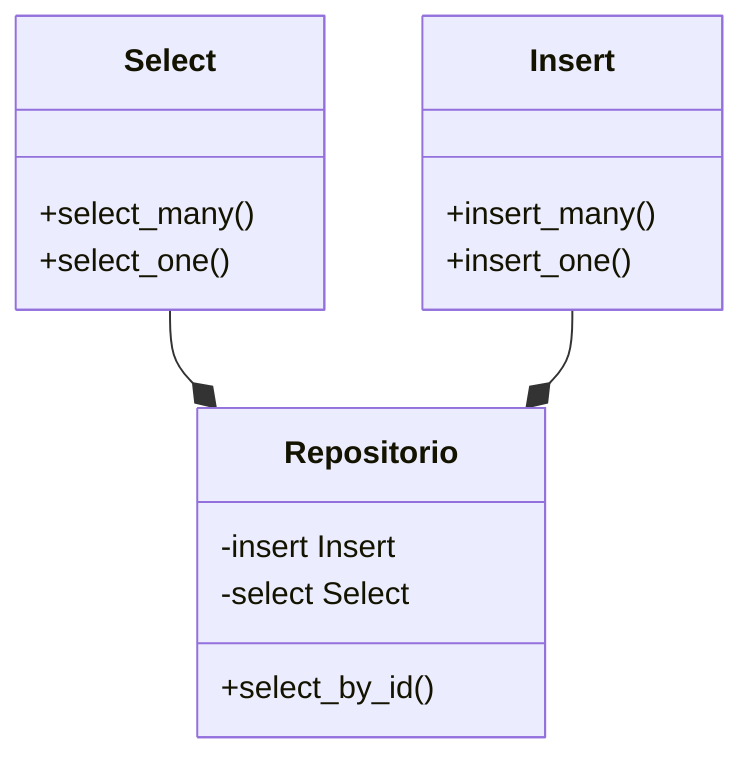

## conseguimos utilziar tudo que uma classe tem a partir de uma outra Relação (Composição)

Outras Classes vão compor o comportamento que uma classe vai ter. -> Padrão Faked

### Diagrama UML

```mermaid
classDiagram

    Select --* Repositorio  
    Insert --* Repositorio


    class Repositorio {
        -insert Insert
        -select Select
        +select_by_id()
        
    }

    class Select {
        +select_many()
        +select_one()
    }

    class Insert {
        +insert_many()
        +insert_one()
    }

```
