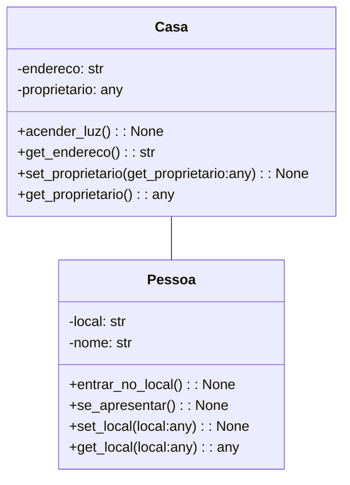

```mermaid
classDiagram
     Casa -- Pessoa

     class Casa {
        -endereco: str
        -proprietario: any
        +acender_luz(): None
        +get_endereco(): str
        +set_proprietario(get_proprietario:any): None
        +get_proprietario(): any
     }

     class Pessoa {
        -local: str
        -nome: str
        +entrar_no_local(): None
        +se_apresentar(): None
        +set_local(local:any): None
        +get_local(local:any): any
     }

```

