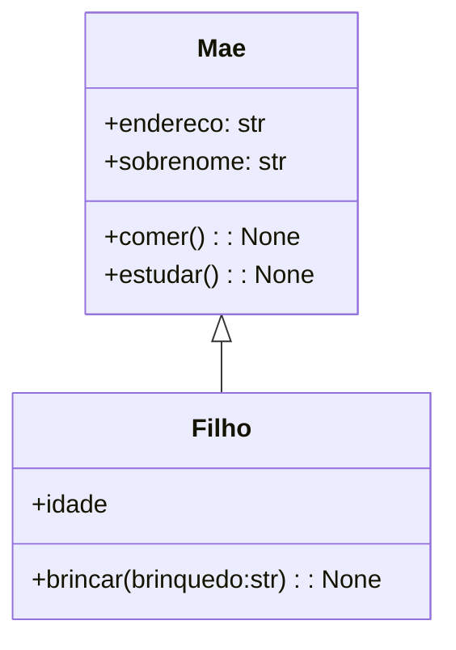

```mermaid
classDiagram
     Mae <|-- Filho

     class Mae {
        +endereco: str
        +sobrenome: str
        +comer(): None
        +estudar(): None
     }

     class Filho {
        +idade
        +brincar(brinquedo:str): None
     }

```

