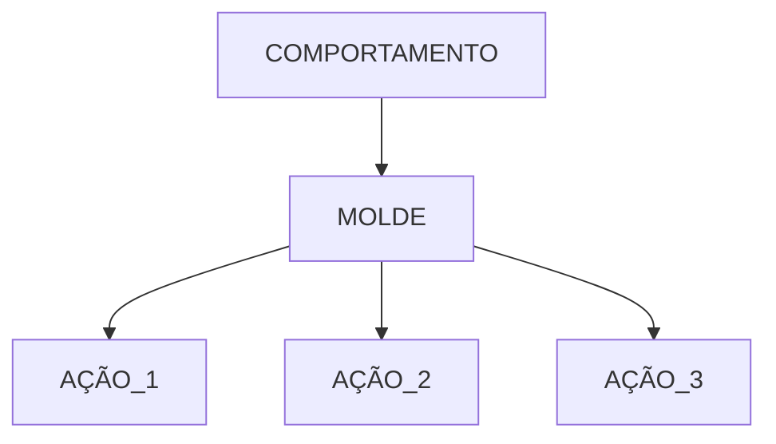

## SOLID - (O) - Principio Aberto e Fechado

- Um módulo é considerado Fechado se estiver disponível para uso por outraos módulos, isso pressupõe que o módulo recebeu uma describação bem definida e estável.
- Um módulo é será considerado Aberto se ainda estiver disponível para extensão. Por exemplo, deve ser possível adicionar campos às estruturas de dados que contém ou novos elementos ao conjunto de funções que executa.

<center>

O Molde seria uma interface



<hr>

```plantuml
@startuml
package "Diagrama UML" #DDDDDD {
    class Circo {
        +apresentar_espetaculo(apresentador:any): None
    }

    class Malabarista {
        + apresentar(): None
    }

    class Palhaco {
        + apresentar(): None
    }

    Circo --> Malabarista
    Circo --> Palhaco
}
@enduml

</center>
