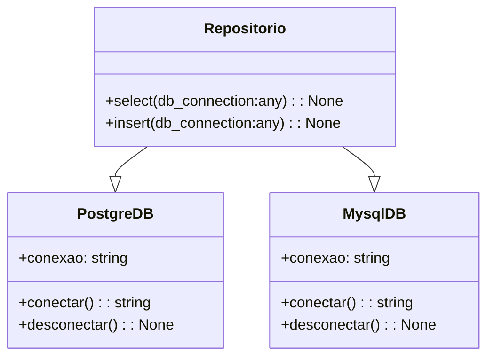

## SOLID - (O) - Principio Aberto e Fechado

```mermaid
classDiagram
     Repositorio --|> PostgreDB
     Repositorio --|> MysqlDB

     class Repositorio {
        +select(db_connection:any): None
        +insert(db_connection:any): None
     }

     class PostgreDB {
        +conexao: string
        +conectar(): string
        +desconectar(): None
     }

     class MysqlDB {
        +conexao: string
        +conectar(): string
        +desconectar(): None
     }
```

