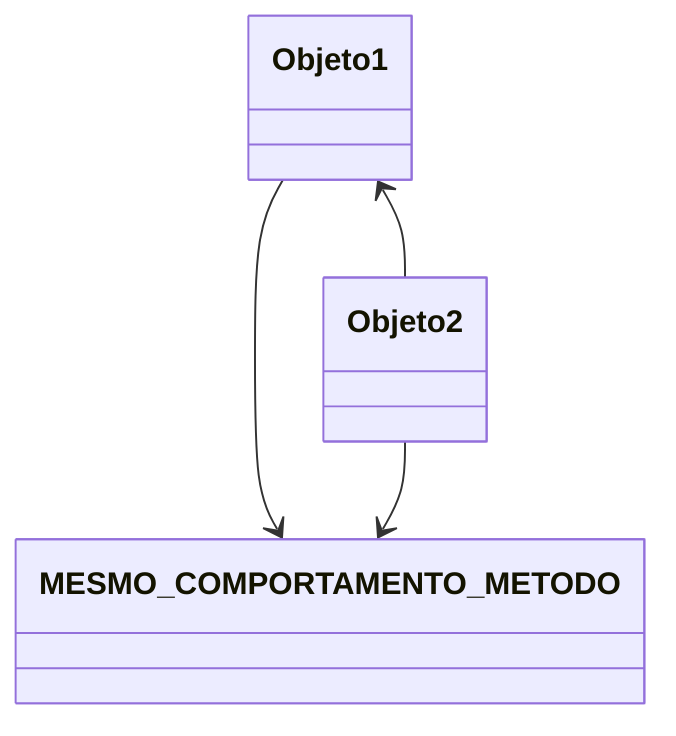
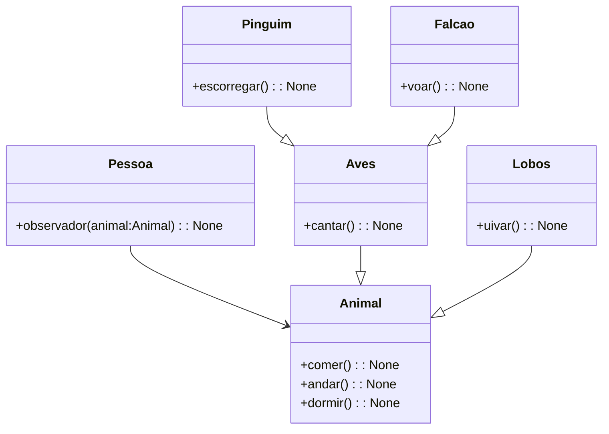
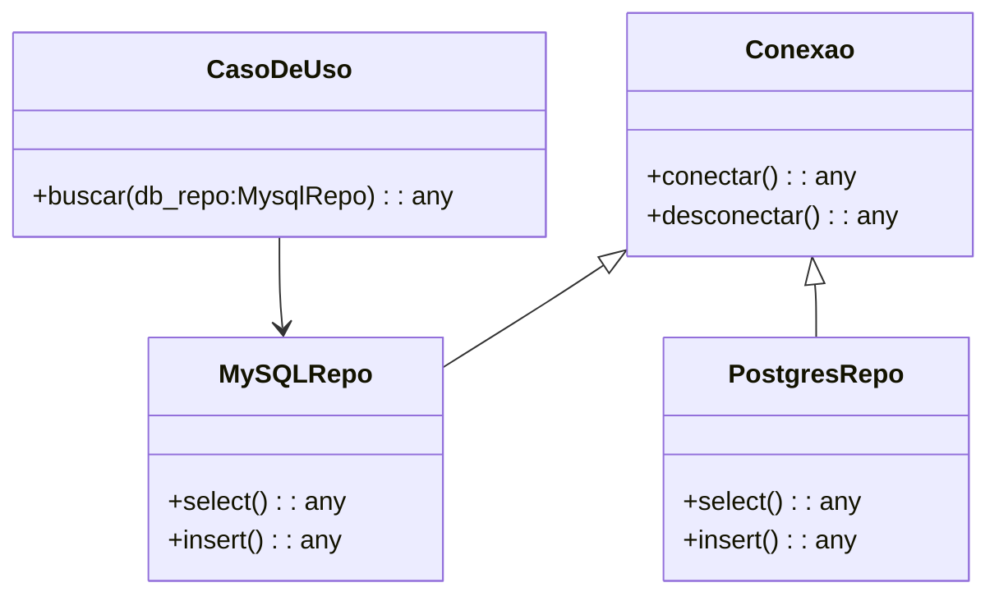

## SOLID - (L) - Principio da Substituição de Liskov

 Mesma funcionalidade para o mesmo método! 

 Herança como complementação. 

 Especificar o mais genérico em cima da árvore. 

Mesma funcionalidade para o mesmo método!

<h3>Zoologico</h3>

<h3>Conexão</h3>

