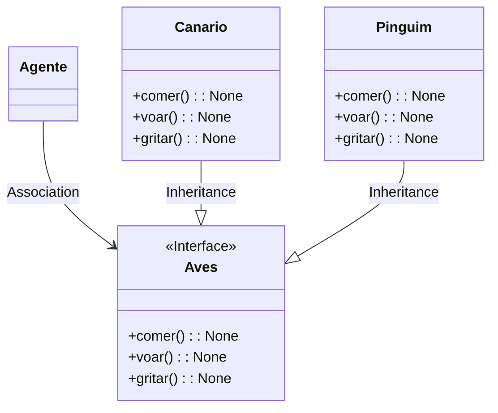
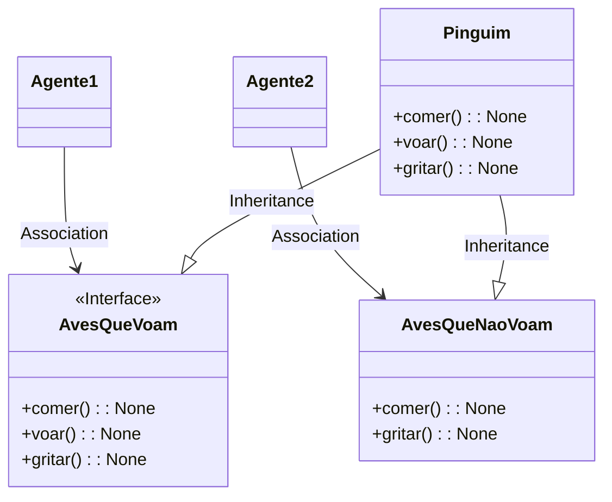

# Interfaces Especificas

### Interface Aves: cada classe que herdam essa interface, acaba tendo que implementar todos seus metodos, mas no caso fazendo uma analise bem rapida para o pinguim. Realmente o pinguim é uma Ave, mas ele não voa, então seriamos "forçados" a implementar esse metodo sem necessidade, deixando a arquitetura um pouco confusa. Para isso podemos criar dois "moldes de interfaces" diferentes. Uma interface AvesQueVoam, AvesQueNaoVoam, como mostrado no diagrama 2.

<h3> Interface </h3>

<h3> Segregação de Interfaces</h3>

