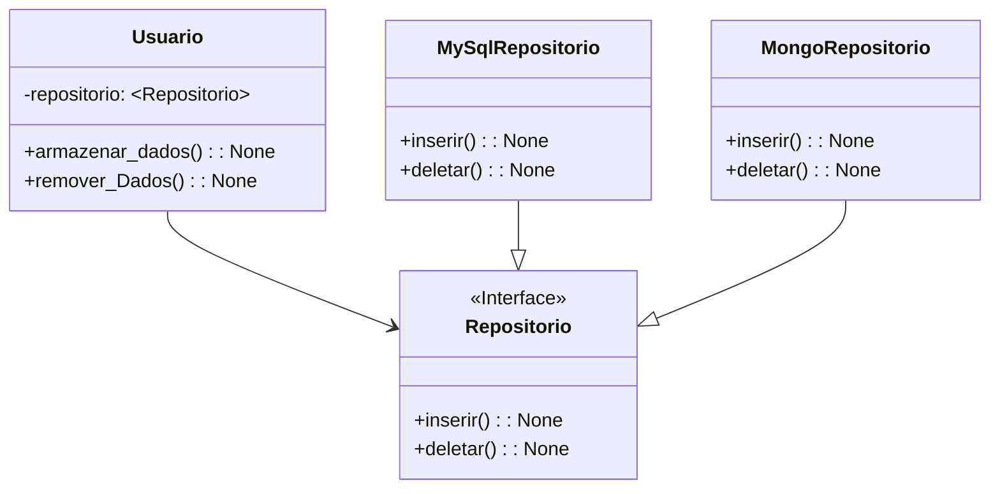

### Injeção de Dependencia: Através de um objeto injetado para outra classe, conseguimos utilziar os metodos da classe injetada

### Principio da Inversão da Dependencia: através de uma interface molde conseguimos instanciar objetos que implementar essa interface, como no exemplo abaixo, não dependendo diretamente de uma classe

 

### Inversão da Dependência

