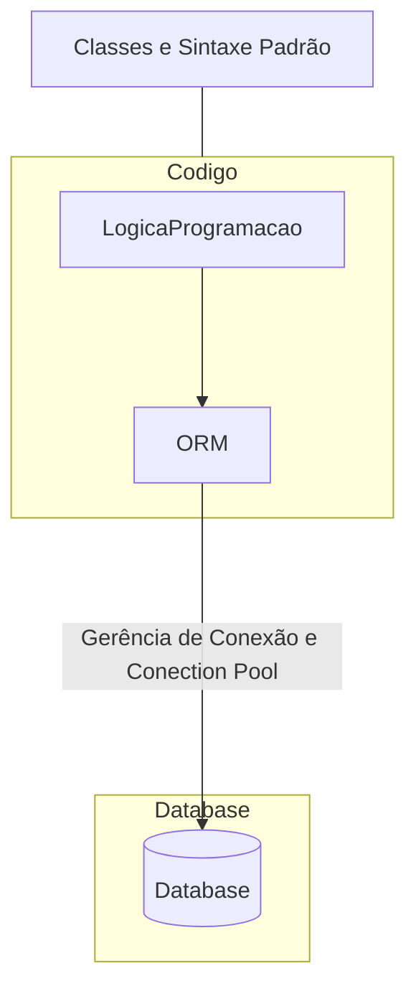

# Introdução - SQLAlchemy

## 1. O que é ORM  (Object Relational Mapper) ?

É uma técnica de desenvolvimento utilizada para produzir a impedância da POO. Basicamente oferece aos desenvolvedores todo o poder e flexibidade do SQL.

| Banco de Dados Relacional | Programação Orientada a Objetos |
| ------------------------- | ------------------------------- |
| Tabela                    | Classe                          |
| Coluna                    | Atributo                        |
| Registro                  | Objeto                          |

<h2>Interação Gerenciada Pela ORM</h2>

Documentação SQLAlchemy: <https://www.sqlalchemy.org/>
